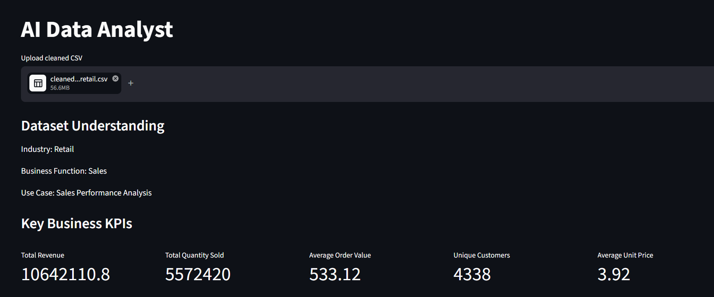
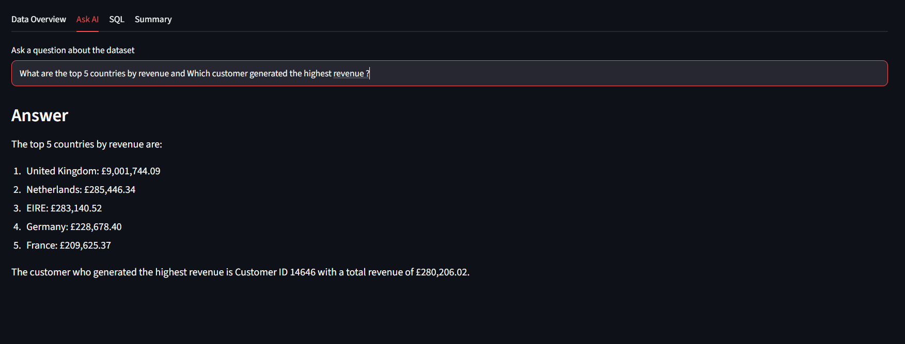
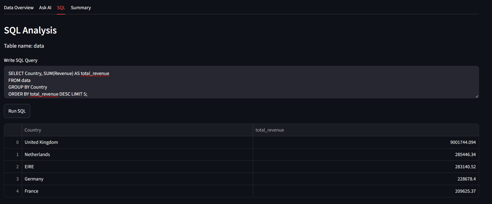
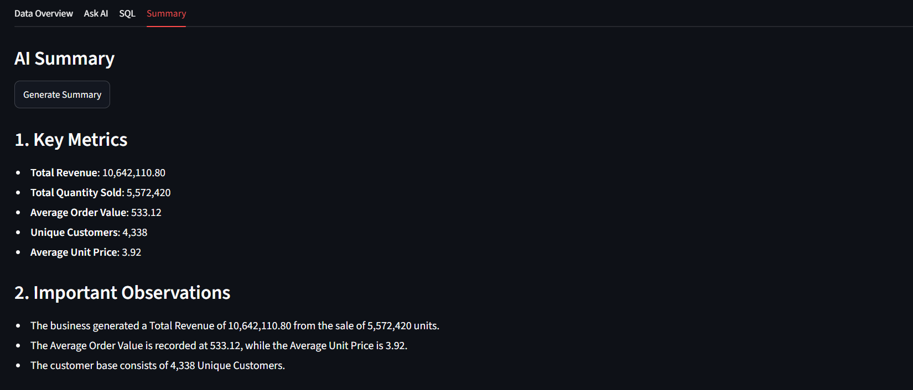

# "AI Data Analyst Project"
Live Demo: https://ai-data-analyst-orkj9domqvnpygezp4psry.streamlit.app/

A simple AI-powered data analysis project built with Python, Streamlit, Pandas, LangChain, Groq and DuckDB.

The main idea of this project is to upload a cleaned CSV file and analyze it in different ways from one application.

# What this project does

The app has four main sections:

- **Data Overview** - shows rows, columns, sample data, data types, missing values and duplicates

- **Ask AI** - allows users to ask questions about the uploaded dataset in natural language

- **SQL** - allows direct SQL queries on the uploaded DataFrame using DuckDB

- **Summary** - generates a short business summary from calculated KPI values

The app also tries to understand the dataset domain and automatically selects useful business KPIs.

# Project Flow-

```text
                 CSV File
                    |
                    v
             Pandas DataFrame
                    |
          +---------+---------+
          |                   |
          v                   v
   Domain Engine        Pandas Agent
          |                   |
          v                   v
   KPI Definitions       Ask AI Questions
          |
          v
      KPI Engine
          |
          v
   Calculated KPIs
          |
          v
  Streamlit Dashboard
          |
          v
      AI Summary
```

# Main Files -

# app.py

Main Streamlit application.

It handles:

- CSV upload
- dataset overview
- KPI display
- Ask AI section
- SQL section
- AI summary

# domain_engine.py

Uses the LLM to understand the dataset from column names and sample rows.

It identifies:

- industry
- business function
- use case
- 5 useful KPIs

The LLM only defines the KPI logic. It does not calculate the final values.

# kpi_engine.py

Calculates KPI values using Pandas.

Supported calculations include:

- sum
- mean
- median
- count
- unique count
- minimum
- maximum
- ratio-based KPIs

# data_cleaning.ipynb

Notebook used for cleaning and preparing the Online Retail dataset used while developing and testing the project.

# Example Dataset

The project was tested using an Online Retail transaction dataset.

After cleaning, the dataset contains:

- 524,878 rows
- 13 columns
- 0 duplicate rows

Some important columns are:

InvoiceNo
StockCode
Description
Quantity
InvoiceDate
UnitPrice
CustomerID
Country
Revenue

# KPIs

For the retail dataset, the application generated KPIs such as:

- Total Revenue
- Total Quantity Sold
- Average Order Value
- Unique Customers
- Average Unit Price

The actual KPI values are calculated using Pandas, not generated by the LLM.




# Ask AI

The Ask AI section uses a Pandas DataFrame Agent.

Example questions:

Which country generated the highest total revenue?

What are the top 5 countries by revenue?

How many unique customers are in the dataset?

Which customer generated the highest revenue?

The LLM understands the question and generates the required Pandas operation. The operation is then executed on the uploaded DataFrame.



# SQL Analysis

DuckDB is used to run SQL directly on the Pandas DataFrame.

The registered table name is: data

Example query:
```text
SELECT Country, SUM(Revenue) AS total_revenue
FROM data
GROUP BY Country
ORDER BY total_revenue DESC
LIMIT 5;
```



# AI Summary

The summary is generated only after KPI values are calculated.


The project follows this simple rule:

LLM -> understand and define
Python/Pandas -> calculate
LLM -> summarize


This helps reduce incorrect numerical values generated directly by the LLM.

# Tech Stack

- Python
- Pandas
- Streamlit
- LangChain
- Groq LLM
- DuckDB
- Jupyter Notebook
- Git / GitHub

# Recommended Project Structure

```text

AI-data-analyst/
|
|-- app.py
|-- domain_engine.py
|-- kpi_engine.py
|-- data_cleaning.ipynb
|-- requirements.txt
|-- .gitignore
|-- README.md
```

The following local files are not included in the repository:
- raw_csv_data/
- cleaned_online_retail.csv
- customer_transactions.csv
- .env
- .venv/
- notes.md


# Setup

1.Create a virtual environment : "python -m venv .venv"

2.Activate it on Windows : ".venv\Scripts\activate"

3.Install dependencies : "pip install -r requirements.txt"

4.Create a '.env' file and add the Groq API key:

GROQ_API_KEY=your_api_key

5.Run the Streamlit app : streamlit run app.py


# Current Limitations

- Currently supports CSV files
- KPI selection depends on dataset columns and business context
- LLM-generated analysis may not always be perfect
- Mixed-type identifier columns can behave differently between Pandas and SQL engines
- Advanced time-based and filtered KPIs are not yet included


# Future Improvements

- Test with datasets from multiple domains
- Add Excel support
- Add automatic charts
- Add more KPI types
- Improve generic data type handling
- Add downloadable analysis reports


--------------------------------------------------Done---------------------------------------------------